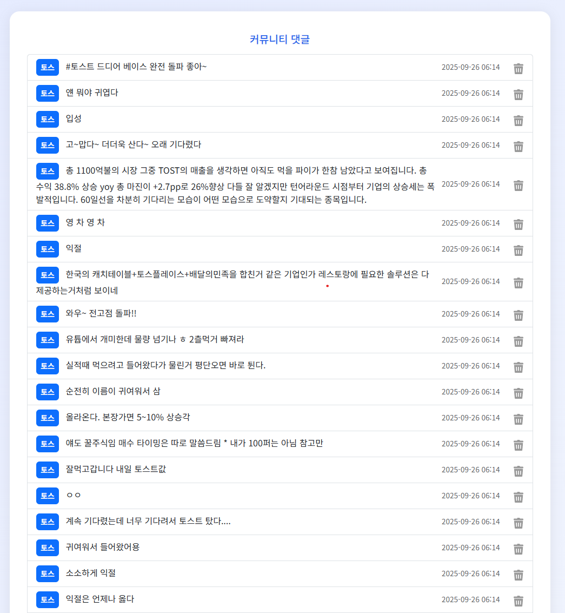

# 💸 관통PJT-04 (금융)

## 📌 프로젝트 개요

이 프로젝트는 **토스 증권**의 커뮤니티 데이터를 크롤링하고 이를 **Django 웹 애플리케이션**을 통해 관리하는 시스템을 구현하는 것입니다. 사용자가 관심 종목을 입력하면 해당 종목에 대한 커뮤니티 댓글을 **Selenium**과 **BeautifulSoup**을 사용해 크롤링하여 데이터베이스에 저장하고, 이를 웹 페이지에서 출력 및 삭제할 수 있습니다. 추가적으로 **OpenAI API**를 활용하여 댓글 여론을 분석하는 기능도 구현하였습니다.

---

## 🛠 개발 환경

- **Language & Framework**: Python, Django, Bootstrap
- **Web Crawling**: **Selenium**, BeautifulSoup4, Requests
- **Database**: SQLite
- **IDE**: Visual Studio Code

---

## 👥 팀원

- 김현아 
- 박지연 AI 박사님

---

## 📋 작업 순서

1. **요구사항 분석**
2. **역할 분담**
   - 김현아: 프로젝트 설계, 화면 구성 및 기능 개발
   - 박지연: 기능 개발, OpenAI API 분석
3. **기능 구현**
4. **코드 정리 및 GitLab 업로드**

---

## ✅ 요구사항 명세

### 🔹 F01 - 종목 입력 화면

- 사용자로부터 종목명을 입력받는 입력 필드 제공
- 입력된 종목명은 추후 크롤링을 위한 키워드로 사용

---

### 🔹 F02 - 종목 데이터 크롤링

- Selenium을 이용해 토스 증권 커뮤니티의 댓글 데이터 크롤링
- BeautifulSoup4와 함께 활용하여 HTML 파싱
- 수집한 데이터는 SQLite에 저장
- ORM을 활용하여 model에 코드 작성후 마이그레이션 하기!!!!

---

### 🔹 F03 - 댓글 목록 출력

- 저장된 댓글 데이터를 Django 템플릿에서 출력
- 댓글 정보(작성자, 내용, 시간 등)를 리스트 형태로 표시

---

### 🔹 F04 - 댓글 삭제

- 각 댓글 옆에 삭제 버튼 배치
- 버튼 클릭 시 해당 댓글을 DB에서 제거

---

### 🔹 F05 - OpenAI API 여론 분석 (심화)

- 댓글을 OpenAI API에 전달
- 긍정 / 부정 / 중립으로 분류
- 분석 결과를 웹 페이지에 출력

---

## ⚙️ 비기능 요구사항

### 📄 NF01 - 문서화 (README 작성)

- 구현 과정, 배운 점, 어려웠던 점, 새롭게 익힌 내용을 README로 정리

### 🔧 NF02 - Git 관리

- GitLab에 프로젝트 업로드
- 프로젝트명: `04_pjt`

### 🧹 NF03 - 유지보수

- `.gitignore`를 추가하여 불필요한 파일 제외
- 코드 정리 및 주석 추가

---

## 🧠 느낀 점

- Selenium과 BeautifulSoup을 함께 사용할 때 동적/정적 페이지의 처리 방식이 달라서 많은 실험이 필요했습니다.
- Django의 MTV 패턴 구조에 익숙해졌고, CRUD 기능 구현이 점점 수월해졌습니다.
- OpenAI API를 활용한 여론 분석은 색다른 경험이었으며, 간단한 텍스트 분석 모델링을 시도할 수 있는 계기가 되었습니다.
- 웹 크롤링과 웹 개발이 어떻게 연계될 수 있는지를 실무적으로 체험할 수 있었습니다.

---

## 📸 프로젝트 스크린샷

> 주요 기능별 화면 UI 입니다.

- 종목 입력 화면 & 여론 분석 결과 화면
  

- 댓글 출력 화면  & 삭제 기능
  

---

## 📂 프로젝트 구조

04_pjt/
├── crawlings/
│ ├── migrations/
│ ├── templates/
│ │ └── index.html
│ ├── views.py
│ ├── models.py
│ └── urls.py
├── crud/
│ ├── setting.py
│ └── urls.py
├── venv
├── .gitignore
├── db.sqlite3
├── manage.py
├── requirements.txt
└── README.md

## 느낀 점

웹 크롤링, 데이터 저장, 웹 인터페이스 구축, AI API 연동까지 폭넓은 기술을 다룰 수 있는 실습이었습니다. 단순한 데이터 수집을 넘어서, 실무에서 자주 활용되는 기능들을 팀원과 함께 구현하며 협업 능력과 기술 응용력을 키울 수 있었습니다.
